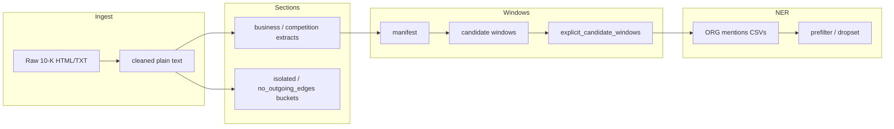

# SEC 10-K → Competition Evidence Pipeline

This repository implements an **end-to-end pipeline** from raw SEC Form 10-K filings to **short text windows** that are likely to contain **explicit competitive language**, and from there to **organization (company) name mentions** suitable for downstream graph or entity-linking work.

The work sits at the intersection of **information extraction** and **corporate disclosure text**: 10-Ks are long, inconsistently structured HTML documents. The code favors **auditable heuristics** (regex, section boundaries, cue phrases) before heavier models, so you can trace *why* a filing or sentence was included or excluded.

---

## Table of contents

1. [Problem and goals](#problem-and-goals)
2. [High-level pipeline](#high-level-pipeline)
3. [Why these design choices](#why-these-design-choices)
4. [Script and module index](#script-and-module-index)
5. [Stage 1: Cleaning, section extraction, and routing](#stage-1-cleaning-section-extraction-and-routing)
6. [Stage 2: Manifest](#stage-2-manifest)
7. [Stage 3: Candidate windows (ABCD)](#stage-3-candidate-windows-abcd)
8. [Stage 4: Explicit windows](#stage-4-explicit-windows)
9. [Stage 5: Organization mentions (NER)](#stage-5-organization-mentions-ner)
10. [Mention quality: prefilter and dropset](#mention-quality-prefilter-and-dropset)
11. [Dependencies](#dependencies)
12. [Open challenges and limitations](#open-challenges-and-limitations)
13. [Reference: folders, routing, audits, thresholds](#reference-folders-routing-audits-thresholds)

---

## Problem and goals

**Problem.** To study **competitive relationships** between firms using public text, you need:

- Clean plain text (not raw HTML/XBRL noise).
- Reliable anchors for **Item 1 (Business)** and, where present, **competition** subsections—filers use many heading variants.
- A way to find **sentences that actually name or allude to rivals** without reading every filing by hand.
- **Candidate company names** extracted from those sentences, as a step toward a **competition graph** (edges: “A names B as a competitor”).

**What this codebase does well**

- Mass **ingestion and cleaning** of 10-K primary documents.
- **Conservative section slicing** with explicit min/max lengths and isolation buckets for failures.
- **Cue-based windowing** with tiers (strict / contextual / broad) and overlap deduplication—optimized for recall of explicit competitor language while separating noise.
- **Dual NER** (spaCy + Hugging Face) with offset mapping back to original window text for traceability.

**What is explicitly out of scope (so far)**

- End-to-end **CIK resolution** or ticker linking for every extracted string.
- Training a custom competition classifier on labeled data (the pipeline is mostly **rules + off-the-shelf NER**).
- Full **implicit competition** (e.g. strategic substitutes named without “competitor” language)—some hooks exist (`implicit_or_broad`, `future_profile_hint`) but they are not the primary deliverable.

---

## High-level pipeline



**Typical flow**

1. Run the main processor (`a.py` / `script.py` / `restore_2023_outputs.py`—see [index](#script-and-module-index)) to populate `*_10K_cleaned/`, `*_10K_business/`, and audit/isolation folders.
2. Optionally **`append_competition_to_business.py`** when both business and competition blocks exist in the cleaned file, so competition prose is available in the same file used for windowing.
3. **`build_manifest.py`** — inventory of extracted `*_business.txt` files.
4. **`abcd.py`** (or `build_candidate_windows.py`) — cue-based **`candidate_windows.*`** + **`window_audit_summary.txt`**.
5. **`build_explicit_candidate_windows.py`** / **`abcde.py`** — strict + contextual rows only, stable schema, **`explicit_candidate_windows.csv`**.
6. **`abcdef.py`** — spaCy + HF NER → window-level raw/nonraw + optional org-diff log. **`extract_explicit_mentions_raw.py`** is a slimmer variant (mention-per-row only).

---

## Why these design choices

| Choice | Rationale |
|--------|-----------|
| **Regex + section headers** for Item 1 | SEC filings follow loose conventions; ML on full documents is expensive and opaque. Header-driven cuts are **debuggable** and match how lawyers structure 10-Ks. |
| **`no_outgoing_edges` vs `10K_business`** | For a **competition graph**, filings whose business text never mentions competition terms are structurally “no edge”—separate folder avoids false negatives in edge construction. |
| **Four cue groups + demotion** | Not every “competitive” sentence names a rival. **Demotion** patterns reduce catalog/regulation/boilerplate hits. **Strict** cues target list-like competitor sentences. |
| **Overlap dedup (bigram Jaccard-style)** | Adjacent sentences can trigger duplicate windows; dedup saves annotation/NER cost. **`analyze_dedup.py`** exists to verify we do not merge distinct evidence. |
| **Heading fallback (in `abcd.py`)** | If a competition heading exists but no cue fired, you still get a **low-priority** window so human or downstream review can recover recall. |
| **Dual NER + span merge** | Single models miss spans or mis-tag; **union** improves recall. Offsets map through **normalized text** so spans align to **original** `window_text`. |
| **`org_mention_junk_dropset` + `prefilter`** | NER emits **legal suffixes, geographies, fragments**. A **sample-informed** dropset (RoBERTa `org_detection_mentions_2000_*`, plus `ORG_Strict_Raw_600*`) supports automatic junk removal before alias/edge work—transparently versioned. |

---

## Script and module index

| Artifact | Role |
|----------|------|
| **`a.py`** | Main **2024** (and configurable) pipeline: HTML clean, business/competition extraction, audits, isolated buckets. Contains **hardcoded `PATH`**—adjust for your machine. |
| **`script.py`** | Same family as `a.py` for **2023 + 2024** style layouts. |
| **`restore_2023_outputs.py`** | **2023** reprocessing from `SEC/2023_10K_raw` with local `OUTPUT_DIRS`—useful when normalizing folder layout. |
| **`append_competition_to_business.py`** / **`ab.py`** | When cleaned filings contain **both** business and competition sections, **append** competition text to the paired business extract so cueing sees full context. |
| **`build_manifest.py`** | Filename + size manifest over `*_10K_business`; no NLP. |
| **`abcd.py`** | **Primary** ABCD step: manifest → **`candidate_windows.csv`**, **`candidate_windows.jsonl`**, **`window_audit_summary.txt`**. Includes heading fallback and tqdm. |
| **`build_candidate_windows.py`** | Same conceptual step as `abcd.py`; **variant** (e.g. cue/fallback differences—use one consistently per study). |
| **`build_explicit_candidate_windows.py`** / **`abcde.py`** | Filter to **strict + contextual explicit** rows; dedupe; assign **`window_id`** → **`explicit_candidate_windows.csv`**. |
| **`abcdef.py`** | **Window-level** ORG harvest: raw columns, **`_nonraw`** dedupe, **`_org_diff`** span analysis. |
| **`extract_explicit_mentions_raw.py`** | **One row per mention span** (no window aggregation / org-diff). |
| **`org_mention_prefilter.py`** | Labels each raw mention string: `keep` / `drop_obvious_junk` / `review` (see [§ Mention quality](#mention-quality-prefilter-and-dropset)). |
| **`org_mention_junk_dropset.py`** | **Data-only** policy for the prefilter: exact sets, regexes, review list; versioned as `DROPSPEC_VERSION` / `DROPSPEC_EVIDENCE` (examples in [§ Mention quality](#mention-quality-prefilter-and-dropset)). |
| **`count_competition_only.py`** | Heuristic **count** of extracts that look **competition-only** (no business header in snippet). |
| **`isolate_no_outgoing_edges.py`** | **Moves** files from `2023_10K_business` into `2023_no_outgoing_edges` per audit JSON list. |
| **`cleanup_recheck.py`**, **`update_json_paths.py`**, **`update_folder_names.py`** | Small **2023 list / path** maintenance scripts for `2023_business_no_competition_term_list.json`. |
| **`analyze_dedup.py`** | Validates **deduplication** behavior on JSONL (overlap logic aligned with ABCD). |
| **`sample_windows.py`** | Random samples from a candidate JSONL for quick QA. |

---

## Stage 1: Cleaning, section extraction, and routing

Raw SEC submissions are parsed from `<DOCUMENT>` / `<TEXT>` blocks, cleaned (HTML entities, BeautifulSoup where applicable), and scanned for **business** and **competition** start/end patterns. Length thresholds drop unusably short sections. Files that cannot be classified usefully land in **isolated** subfolders; filings with a business section but **no** competition header and **no** competition terms in the extracted business text go to **`no_outgoing_edges`**.

The full routing table and folder semantics are in [Reference](#reference-folders-routing-audits-thresholds).

---

## Stage 2: Manifest

See **`build_manifest.py`** in the [reference section](#manifest-builder--build_manifestpy) below. The manifest is the join key between **filing identity** (date, accession, company name, CIK from filename) and **on-disk text paths** for ABCD.

---

## Stage 3: Candidate windows (ABCD)

**`abcd.py`** (recommended) reads the manifest and section files, splits sentences, matches **cue patterns** (strict / contextual / implicit / demotion), expands **sentence windows**, scores priorities, and deduplicates overlapping windows. It writes **`window_audit_summary.txt`** for coverage and quality monitoring.

Interpretation of the audit file (counts, tiers, fallback) is documented below under [ABCD Candidate Windows](#abcd-candidate-windows--abcdpy).

---

## Stage 4: Explicit windows

**`build_explicit_candidate_windows.py`** keeps only **strict_explicit** and **contextual_explicit** rows, normalizes column names across ABCD vs combined exports, drops duplicate evidence rows, and emits a stable **`explicit_candidate_windows.csv`** for NER.

---

## Stage 5: Organization mentions (NER)

### `abcdef.py` (full window-level outputs)

Runs **spaCy** (`en_core_web_sm` by default) and **Hugging Face** token classification (default **`Jean-Baptiste/roberta-large-ner-english`**). Keeps **ORG** (spaCy) and **ORG + MISC** (HF—MISC often catches company-like phrases). Merges identical spans from both models.

Outputs (given `-o my_raw.csv`):

1. **`my_raw.csv`** — one row per **window**; `org_mentions_raw`, offsets, extractors.
2. **`my_raw_nonraw.csv`** — same windows, **unique** mention strings.
3. **`my_raw_org_diff.csv`** (or `--org-diff-log`) — span-level diff between raw and deduped views.

```bash
pip install -r requirements-explicit-mentions.txt
python -m spacy download en_core_web_sm
python abcdef.py -i explicit_candidate_windows.csv -o ORG_out_raw.csv
```

### `extract_explicit_mentions_raw.py` (mention-per-row)

Same models and normalization, but output is **one row per mention span** (`raw_mention`, `mention_start`, `mention_end`, …). No bundled nonraw/org-diff artifacts—use when you only need a flat mention list.

---

## Mention quality: prefilter and dropset

NER tags **strings**, not resolved entities: legal suffixes, geography, punctuation-only spans, payers, and filing boilerplate often appear as `ORG`. The junk layer sits **after** span extraction and **before** alias resolution or edge construction so downstream steps do not treat obvious noise as company names.

| Piece | Role |
|--------|------|
| **`org_mention_junk_dropset.py`** | **Data only** — `WHITELIST_EXACT_CASEFOLD`, `EXACT_DROP_CASEFOLD`, `DROP_REGEX`, `REVIEW_EXACT_CASEFOLD`. No I/O. Tuned on RoBERTa **`org_detection_mentions_2000_*`** plus earlier strict 600-window runs. |
| **`org_mention_prefilter.py`** | **Policy** — `normalize_mention()` (quotes/apostrophes → ASCII), `merge_dot_com_spans()`, `MentionFilter.label()`, `label_mention(..., source_company=...)`. Dropset rules plus optional self-filer suppression. |

**Versioning.** `DROPSPEC_VERSION` bumps when rules change materially; `DROPSPEC_EVIDENCE` names the sample CSVs the policy was grounded in. `org_mention_prefilter.export_dropset_snapshot()` (and `org_mention_junk_dropset.json`) mirror the live sets for diffs.

**Labels.**

- **`keep`** — pass through to linking / graph code.
- **`drop_obvious_junk`** — high-confidence non-competitor or non-firm noise (legal shells, lone punctuation, agencies, clinical phrases, etc.).
- **`review`** — short or ambiguous tokens; do not auto-wire as edges unless you promote them (e.g. whitelist).

**Policy (v4 dropset + prefilter).** Smart quotes/apostrophes normalize to ASCII. Single-letter spans drop except **`x`**. Standalone punctuation and pure-numeric strings drop. Stray **TLD** tokens (`com`, `net`, `org`) drop; use **`merge_dot_com_spans`** on `(text, start, end)` lists to rejoin `Bill.`+`com` → `Bill.com`. Generic governance words, agencies, statute `… Act` phrases, biotech/regulatory wording (e.g. inhibitor, patients, FDA approval), SPAC/IPO boilerplate, service phrases (supply chain services, …), regional descriptors, and trial-stage regexes apply as in `org_mention_junk_dropset.py`. **`source_company`** (filer name from the window row) enables **self-name suppression**: the filer is not treated as its own competitor unless you **whitelist** an unusual case.

**Examples** (`label_mention` returns `(label, reason_slug)`):

```python
from org_mention_prefilter import label_mention, merge_dot_com_spans

label_mention("Inc.")                       # drop_obvious_junk / exact_drop
label_mention("Charter")                    # drop_obvious_junk / exact_drop
label_mention("com")                        # drop_obvious_junk / exact_drop  # stray TLD fragment
merge_dot_com_spans([("Bill.", 0, 5), ("com", 5, 8)])  # -> [('Bill.com', 0, 8)]

label_mention("inhibitor")                  # drop_obvious_junk / inhibitor_word
label_mention("FDA approval")              # drop_obvious_junk / fda_approval_phrase
label_mention("initial public offering")   # drop_obvious_junk / exact_drop
label_mention("supply chain services")     # drop_obvious_junk / exact_drop
label_mention("european")                  # drop_obvious_junk / exact_drop

label_mention("Pfizer")                    # keep / default_keep  # rival (no source passed)
label_mention("Pfizer", source_company="Pfizer Inc.")   # drop / self_source_full_match
label_mention("Acme", source_company="Acme Pharmaceuticals, Inc.")  # review / self_source_fragment_review

label_mention("Charter Communications")    # keep / default_keep
label_mention("x")                         # keep / whitelist
label_mention("AWS")                       # keep / whitelist

label_mention("car")                       # review / review_exact
```

Audit with self-suppression: `python org_mention_prefilter.py windows.csv --source-column source_company`

**Extending.** Use `MentionFilter(extra_whitelist={"Medicare"}, extra_drop_exact={"obvious typo inc"})` when a study needs to **keep** or **drop** strings that conflict with the global defaults (e.g. whitelist a payer you want as a node).

---

## Dependencies

- **10-K processing:** `beautifulsoup4`, `lxml`, `tqdm` (see scripts’ imports).
- **ABCD:** standard library + optional **`tqdm`**.
- **NER:** `requirements-explicit-mentions.txt` — `spacy`, `transformers`, `torch`.

---

## Open challenges and limitations

1. **Section extraction brittleness** — Unusual Item 1 titles, embedded TOCs, or multi-column HTML can mis-bound sections. Isolated buckets capture some failures but are not a complete inventory of “missed competition.”
2. **Cue recall vs precision** — Patterns are tuned for common phrasing; rare or non-English firm names in competitor lists may appear in sentences **without** hitting strict cues (mitigated partly by contextual/broad tiers and heading fallback in `abcd.py`).
3. **Dedup edge cases** — Overlap-based dedup can theoretically merge or split evidence in awkward ways; use **`analyze_dedup.py`** and manual spot checks on high-stakes samples.
4. **NER is not entity linking** — `ORG`/`MISC` spans are **strings**, not resolved CIKs. Subsidiary names, joint ventures, and “doing business as” labels need a **linking** layer not included here.
5. **False positives and junk** — Legal entities, industries, and geographies are often tagged as organizations. The **junk dropset** is **conservative** and **sample-grounded**; it will need **iteration** as domains change (e.g. biotech vs retail language).
6. **Configuration drift** — `a.py` / `script.py` use **Windows-style absolute paths** in-repo; **`restore_2023_outputs.py`** uses relative `SEC/` layout. Expect to edit paths when moving machines.
7. **Downstream graph semantics** — Mentioning a company near a competition cue **does not** guarantee a competitive relationship (customers, suppliers, partners). Additional filtering or labeling is required for research-grade edges.

---

## Reference: folders, routing, audits, thresholds

### Output folders

#### `{year}_10K_cleaned/`

**Condition:** The filing was successfully processed and NOT isolated.  
Contains the cleaned plain-text version of every non-isolated filing.

---

#### `{year}_10K_business/`

**Condition:** A business section (≥ 500 chars) or competition section (≥ 300 chars) was extracted, AND the filing was not sent to `no_outgoing_edges`.  
Contains `_business.txt` files with the extracted section text.

---

#### `{year}_no_outgoing_edges/`

**Condition:** All of the following are true:

- A full business section was extracted (`section_source == "business"`, ≥ 500 chars)
- The filing was NOT isolated
- No competition section header was found (e.g. `Item 1 – Competition`)
- No competition terms (`competition`, `competitor`, `competitive`, `compete`, etc.) appear in the extracted business section

These filings mention no competitors in their business section, so they have no outgoing edges in a competition graph.

---

#### `{year}_10K_isolated/`

Filings that could not produce a usable section are isolated here into one of the following subcategories:

##### `isolated/missing_both_no_competition_term/`

**Condition:** All of the following are true:

- No business section header detected
- No competition section header detected
- No competition terms found anywhere in the filing

The filing contains no recognizable section signals at all.

##### `isolated/no_business_header_has_competition_term/`

**Condition:** All of the following are true:

- No business section header detected
- No competition section header detected
- Competition terms are found somewhere in the filing

The filing mentions competition but has no extractable header anchor (neither business nor competition).

##### `isolated/business_header_only/`

**Condition:** Both of the following are true:

- A business or competition header was detected
- No extractable section content was found for those detected headers

At least one expected header exists, but the corresponding section content is missing or too short after cleaning.

---

### Routing decision order

```
Filing
│
├─ Check business header
│   └─ If business header exists, try business extraction (≥ 500 chars)
│
├─ If no business section extracted, check competition header
│   └─ If competition header exists, try competition extraction (≥ 300 chars)
│
├─ If a section was extracted (business OR competition)
│   ├─ If section_source == business AND no competition header AND no competition terms in extracted section
│   │   └─► {year}_no_outgoing_edges/  +  {year}_10K_cleaned/
│   └─ Otherwise
│       └─► {year}_10K_business/  +  {year}_10K_cleaned/
│
└─ If no section was extracted
    ├─ No business header + no competition header + competition terms anywhere
    │   └─► isolated/no_business_header_has_competition_term/
    ├─ No business header + no competition header + no competition terms anywhere
    │   └─► isolated/missing_both_no_competition_term/
    └─ Business header OR competition header exists, but no extractable content
        └─► isolated/business_header_only/
```

---

### Audit files

| File | Description |
|------|-------------|
| `{year}_10k_audit.csv/.json` | Full audit log for every processed filing |
| `{year}_10k_isolated_audit.csv/.json` | Subset of audit log — isolated filings only |
| `header_only_business_filings_audited.csv/.json` | Detailed audit of `business_header_only` filings including recheck results |
| `2023_business_no_competition_term_list.csv/.json` | List of filings routed to `no_outgoing_edges` |
| `missing_business_audit_rechecked.csv/.json` | Recheck results for filings missing a business section |

---

### Section extraction thresholds

| Function | Min length | Max length |
|----------|------------|------------|
| `extract_business_section()` | 500 chars | 500,000 chars |
| `extract_competition_section()` | 300 chars | 500,000 chars |
| `extract_business_header_only()` | 20 chars | 499 chars |

---

## Manifest builder — `build_manifest.py`

### Purpose

`build_manifest.py` scans a folder of **already-extracted** filing text files
(e.g. `2024_10k_business/`) and produces a structured manifest in both **CSV**
and **JSON** format, plus a lightweight **parse-issues audit file**.

This script does **not** re-process raw filings, run NLP, split text into
windows, or infer any semantic content. It works only from the filenames and
raw character/line counts of the extracted text files.

### Usage

```bash
# Basic — process default inputs (2023 + 2024)
python build_manifest.py

# Single input folder
python build_manifest.py --input-dir 2024_10K_business

# Specify a separate output base directory
# (script creates year folders like 2024_manifest under this base)
python build_manifest.py --input-dir 2024_10K_business --output-dir ./manifests

# Also scan subdirectories (recursive)
python build_manifest.py --input-dir 2024_10K_business --recursive

# Change the large-file threshold (default: 200000 chars)
python build_manifest.py --input-dir 2024_10K_business --large-threshold 250000

# Optional random sampling
python build_manifest.py --input-dir 2023_10K_business --sample-size 200 --sample-seed 42
```

No third-party dependencies — only the Python standard library.

### Expected filename format

```
YYYY-MM-DD__COMPANY NAME__ACCESSION_sectiontype.txt
```

| Segment | Example | Notes |
|---------|---------|-------|
| Date | `2024-01-31` | Leading `YYYY-MM-DD` |
| Company name | `COMCAST CORP` | Middle segment, between `__` delimiters |
| Accession | `0001166691-24-000011` | `##########-##-######` |
| Section type | `business` | Suffix after the final `_` and before `.txt` |

Full example: `2024-01-31__COMCAST CORP__0001166691-24-000011_business.txt`

The parser is robust to:

- Extra underscores or spaces around segment boundaries
- All-uppercase company names (auto title-cased for readability)
- Mixed-case company names (preserved as-is)
- Parenthetical suffixes like `(1)` — handled gracefully
- Missing section-type suffix — flagged in `parse_notes`

### Parsing logic

| Field | Source | Fallback |
|-------|--------|----------|
| `filing_date` | Leading `YYYY-MM-DD` in filename | — |
| `filing_year` | Derived from `filing_date` | — |
| `source_company_name` | Middle `__`-delimited segment | — |
| `accession_number` | Regex `\d{10}-\d{2}-\d{6}` in filename | — |
| `source_cik` | First 10-digit block of accession (integer form) | — |
| `cik_raw` | Same, with leading zeros preserved | — |
| `section_type` | Suffix after accession, before `.txt` | First 4 KB of file content |

The **content fallback** for `section_type` is triggered only if the filename
parse cannot find the field. It applies a simple regex scan over the first
4 KB of the file — no NLP, no windowing.

### Manifest fields

#### Essential fields

| Field | Type | Description |
|-------|------|-------------|
| `source_company_name` | str | Company name, lightly cleaned |
| `source_cik` | str | CIK as integer string (leading zeros stripped) |
| `filing_year` | str | 4-digit year derived from `filing_date` |
| `filing_date` | str | `YYYY-MM-DD` from filename |
| `accession_number` | str | Raw SEC accession, e.g. `0001166691-24-000011` |
| `original_filename` | str | Exact filename, unchanged |
| `section_type` | str | Extracted section label, e.g. `business` |

#### Helper fields

| Field | Type | Description |
|-------|------|-------------|
| `file_path` | str | Absolute path to the file |
| `file_stem` | str | Filename without `.txt` extension |
| `text_char_count` | int | Total characters in the file |
| `text_line_count` | int | Total lines in the file |
| `is_large` | bool | `True` if char count > `--large-threshold` |
| `has_business_section` | bool | Content heuristic detected business section heading/text |
| `has_competition_section` | bool | Content heuristic detected competition section heading/text |
| `section_presence` | str | One of `both`, `business_only`, `competition_only`, `neither` |
| `parse_success` | bool | `True` if all essential fields were parsed confidently |
| `parse_notes` | str | Human-readable notes on any parse issues or fallbacks |
| `cik_raw` | str | CIK with leading zeros preserved (10 digits) |

### Output files

| File | Description |
|------|-------------|
| `manifest.csv` | One row per `.txt` file, all fields above |
| `manifest.json` | Same data in JSON array format |
| `manifest_parse_issues.txt` | Lists every file where an essential field is missing or a fallback was used |

### Console summary

After running, the script prints a short summary:

```
───────────────────────────────────────────────────────
  MANIFEST SUMMARY  —  /path/to/2024_10K_business
───────────────────────────────────────────────────────
  Total .txt files found     :  1,234
  Successfully parsed        :  1,228
  Failed / partial parses    :      6
  Large files                :      2  (> 200000 chars)
  Distinct section types     :      1
    • business                         1,228
───────────────────────────────────────────────────────
```

When scanning multiple input folders, output is written into year-specific
manifest folders, for example `2023_manifest/` and `2024_manifest/`.

---

## ABCD Candidate Windows — `abcd.py`

### What this step does

`abcd.py` reads a manifest and the corresponding extracted text files, then
builds candidate text windows around competition-related cue phrases.

It writes three bucketed outputs:

- `candidate_windows_strict_explicit.*`
- `candidate_windows_contextual_explicit.*`
- `candidate_windows_broad_or_implicit.*`

and one audit report:

- `window_audit_summary.txt`

The script uses a tqdm progress bar during file scanning.

### How to read `window_audit_summary.txt`

#### File counts

- `Files in manifest (processed)`: total rows loaded from manifest.
- `Files with resolved text path`: rows that resolved to a valid input text path.
- `Files with at least one window`: files that produced one or more candidate windows.
- `Files with zero windows`: files that produced none.

#### Window counts

- `before dedup`: raw windows before overlap deduplication.
- `after dedup`: windows remaining after overlap-aware dedup.
- `Heading fallback windows`: windows created by heading fallback logic.
- `Files rescued by fallback`: files that had no cue windows but got at least one fallback window.

#### By cue_group

- `strict_explicit`: strongest direct competitor language.
- `contextual_explicit`: competitive context language, may be upgraded by heading/nearby strict cues.
- `implicit_or_broad`: broader/indirect competitive signals.
- `heading_fallback_broad`: fallback windows from competition-like headings when no cue windows exist.

#### By cue_tier (importance level)

- `Tier 4`: strict explicit cues.
- `Tier 3`: contextual explicit cues.
- `Tier 2`: implicit/broad cues.
- `Tier 1`: heading fallback windows.

#### Sentences harvested per trigger

ABCD uses different sentence window sizes depending on trigger type:

- `strict_explicit`:
  - default: 1 sentence (trigger only)
  - under competition heading: 3 sentences (previous + trigger + next)
- `contextual_explicit`:
  - default: 3 sentences (previous + trigger + next)
  - upgraded (under competition heading or near strict cue): up to 5 sentences
- `implicit_or_broad`:
  - 1 sentence (trigger only)
- `heading_fallback_broad`:
  - 1 sentence (single fallback sentence from heading block)

Global cap: at most 5 sentences per window.

#### By window_priority (ranking used in dedup preference)

- Higher is stronger.
- Typical mapping:
  - `5`: strict cue under competition heading (bonus)
  - `4`: strict cue
  - `3`: upgraded contextual cue
  - `2`: baseline contextual cue
  - `1`: implicit/broad cue
  - `0`: heading fallback cue

#### By section_type

Derived from content analysis per source file:

- `both`: business and competition sections detected.
- `business_only`: business detected, competition not detected.
- `competition_only`: competition detected, business not detected.
- `neither`: neither detected.

#### Top cue phrases

Most frequent matched cue text values among retained windows.

#### Top demotion reasons

Common contexts that suppress or downgrade weak/non-target cues.

### Fallback and related fields (definitions)

Fields appear in candidate window outputs:

- `is_heading_fallback`:
  - `true` if the window was created by heading fallback instead of a cue phrase.
- `fallback_reason`:
  - currently `competition_heading_without_explicit_cue` for fallback windows.
- `demotion_reason`:
  - reason a contextual signal was demoted/suppressed (for example generic or non-competitor context).

Fallback behavior:

- If a competition-like heading block has no regular cue windows, ABCD may create one very low-priority fallback window from that block.
- This preserves potentially useful competitive context without over-prioritizing it.

### Window output fields (quick definitions)

- `window_id`: stable window identifier.
- `cue_text`: exact matched phrase snippet.
- `cue_group`: strict/contextual/implicit/fallback grouping.
- `cue_tier`: 1-4 strength tier.
- `window_priority`: dedup ranking score.
- `trigger_sentence`: sentence that fired the cue/fallback.
- `window_text`: exported sentence window text.
- `local_heading_category`: nearest heading category.
- `export_bucket`: output bucket (`strict_explicit`, `contextual_explicit`, `broad_or_implicit`).
- `future_profile_hint`: heuristic profile hint for downstream enrichment.

---

## Appendix: `append_competition_to_business.py`

For each file in the cleaned folder that has **both** a business section and a competition section, extracts the competition section (200–50k chars) and **appends** it to the bottom of the matching company’s business file. Self-contained regex logic (aligned with `a.py`); useful when competition prose was extracted to a separate path but you want a **single** file for manifest + ABCD.

---

*README generated for the research workspace; align `PATH` / year constants in entry-point scripts with your local SEC data layout before batch runs.*
