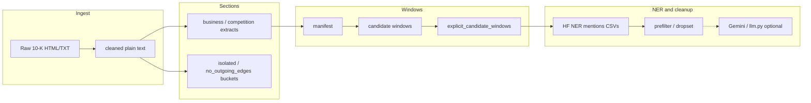
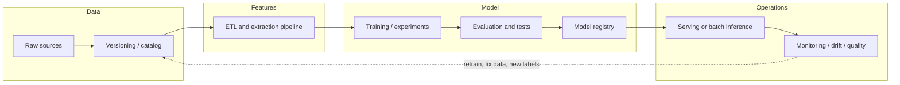

# SEC 10-K → Competition Evidence Pipeline

This repository implements an **end-to-end pipeline** from raw SEC Form 10-K filings to **short text windows** that are likely to contain **explicit competitive language**, and from there to **organization (company) name mentions** suitable for downstream graph or entity-linking work.

The work sits at the intersection of **information extraction** and **corporate disclosure text**: 10-Ks are long, inconsistently structured HTML documents. The code favors **auditable heuristics** (regex, section boundaries, cue phrases) before heavier models, so you can trace *why* a filing or sentence was included or excluded.

---

## Table of contents

1. [Problem and goals](#problem-and-goals)
   - [Temporal motivation: 2023 vs 2024](#temporal-motivation-2023-vs-2024)
2. [Glossary](#glossary)
3. [High-level pipeline](#high-level-pipeline)
4. [End-to-end process order](#end-to-end-process-order)
5. [MLOps overview (reference diagram)](#mlops-overview-reference-diagram)
6. [Why these design choices](#why-these-design-choices)
7. [Script and module index](#script-and-module-index)
8. [Stage 1: Cleaning, section extraction, and routing](#stage-1-cleaning-section-extraction-and-routing)
9. [Stage 2: Manifest](#stage-2-manifest)
10. [Company node list](#company-node-list--build_company_nodespy)
11. [Stage 3: Candidate windows (ABCD)](#stage-3-candidate-windows-abcd)
12. [Stage 4: Explicit windows](#stage-4-explicit-windows)
13. [Stage 5: Organization mentions (NER)](#stage-5-organization-mentions-ner) — `abcdef_auto.py`, `abcdef_ft.py`, `abcdef_v2.py`, flat span script
14. [Mention quality: prefilter and dropset](#mention-quality-prefilter-and-dropset)
15. [Competition extraction: low-information term filter](#competition-extraction-low-information-term-filter)
16. [Dependencies](#dependencies)
17. [Challenges faced throughout the project](#challenges-faced-throughout-the-project)
18. [Open challenges and limitations](#open-challenges-and-limitations)
19. [Reference: folders, routing, audits, thresholds](#reference-folders-routing-audits-thresholds)

---

## Glossary

| Term | Definition |
|------|------------|
| **10-K** | U.S. public companies’ **annual report** to the SEC; includes Item 1 (Business) and often a competition discussion. This pipeline ingests the primary HTML/text document. |
| **SEC** | **Securities and Exchange Commission**; receives filings and assigns identifiers (e.g. CIK, accession numbers). |
| **CIK** | **Central Index Key** — the SEC’s stable **numeric identifier** for a filing entity (issuer). In this repo, CIK is parsed from filenames/accessions (`source_cik`, `cik_raw`); **mention strings** are not automatically linked to CIKs. |
| **Accession number** | SEC **filing-level ID** (format `##########-##-######`), unique per submission; appears in extracted filenames and CSV join keys. |
| **Filer / source company** | The company that **filed** the 10-K (the “ego” firm in a competition graph). Often `source_company` / `source_company_name` in CSVs. |
| **Item 1 (Business)** | Standard 10-K section describing the business; primary source for **business** / **competition** text extracts here. |
| **XBRL** | **eXtensible Business Reporting Language** — structured tagging often embedded in SEC HTML; treated as noise for **plain-text** extraction in this project. |
| **Manifest** | Per-year **inventory** of extracted `*_business.txt` files (paths, CIK, dates, sizes) built by `build_manifest.py`; join key for later stages. |
| **Company node list** | Optional **deduplicated filer table** (`build_company_nodes.py`): one row per CIK with company name, ticker, NAICS-style industry (via SEC SIC + crosswalk), and GICS-style sector (via Yahoo/yfinance)—for graph or modeling prep, not windowing. |
| **ABCD** | **Candidate-window stage**: cue-based **sentence windows** around competitive language (`abcd.py` / related scripts), before the explicit-only filter. |
| **Candidate window** | A **short span of sentences** around a matched **cue phrase**, exported for audit or NER. |
| **Cue phrase / cue group** | The **matched pattern** (and its **tier**: strict, contextual, implicit, etc.) that triggered a window. |
| **Strict explicit** | Highest-priority cue tier: language that **directly** signals competitors (e.g. “our competitors include …”). |
| **Contextual explicit** | Cues that often co-occur with rivals but are **less list-like** than strict (e.g. “highly competitive”). |
| **Explicit windows** | Rows kept after filtering to **strict + contextual explicit** only → `explicit_candidate_windows.csv` for NER. |
| **`window_id`** | Stable ID for one **explicit** window (e.g. `EXPW…`), used to tie mentions back to text. |
| **NER** | **Named entity recognition** — token-level span tagging. **`abcdef_auto.py`** (pretrained) / **`abcdef_ft.py`** (your checkpoint) / **`abcdef_v2.py`** use **Hugging Face** token classification only (**`Jean-Baptiste/roberta-large-ner-english`** by default). **`extract_explicit_mentions_raw.py`** is a separate **per-span** exporter that still bundles **spaCy + HF** in code (see its docstring if you use it). |
| **ORG / LOC / PRODUCT** | CoNLL-style labels the RoBERTa NER can emit. **`abcdef_auto.py`** default **`--hf-keep-labels`** keeps **`ORG,LOC`** (CoNLL-style; see script) and **does not** keep **`PER`** or **`MISC`**. **`abcdef_v2.py`** default keeps **`ORG`** only. |
| **Mention** | A **text span** tagged as a company-like string (not yet a resolved **entity**). |
| **Entity linking** | Mapping a **string** (e.g. “Alphabet Inc.”) to a canonical ID (usually **CIK**). **Out of scope** in-repo; needed for clean graph nodes/edges on the **target** side. |
| **Union mentions** | **Merged** mention list from both extractors (`org_mentions_union`, etc.) before or after prefilter columns. |
| **`org_mentions_union_filtered`** | **Post-prefilter** mention string list (semicolon-joined) — company candidates after junk rules. |
| **Prefilter** | `org_mention_prefilter` policy: **keep** / **drop** / **review** per mention string (plus optional self-filer suppression). |
| **Dropset** | **Data-only** lists/regexes in `org_mention_junk_dropset` that drive obvious-junk removal; versioned with `DROPSPEC_VERSION`. |
| **`pipeline_role`** | Optional **`gemini_mention_label.py`** output: coarse routing label (e.g. explicit company candidate vs product brand vs ignore). |
| **`no_outgoing_edges`** | Routing **folder** for filers whose business text has **no** competition section/header and **no** competition terms → **no** competitor edges in a disclosure graph; filer may still be a **node**. |
| **Isolated** | Filings that failed **section extraction** thresholds or routing; land under `{year}_10K_isolated/` subfolders. |
| **Warm-start / cold-start (node)** | **Warm-start**: node seen in **earlier time slices** (e.g. 2023 and 2024). **Cold-start**: little/no history; **cold-but-observable** can appear first in the latest pre-target year (e.g. 2024 only). |
| **Leakage (temporal)** | Using **future** information when training or evaluating a **past→future** model (e.g. 2025 labels in features for a 2024 snapshot); avoided via **time-aware splits**. |

---

## Problem and goals

**Problem.** To study **competitive relationships** between firms using public text, you need:

- Clean plain text (not raw HTML/XBRL noise).
- Reliable anchors for **Item 1 (Business)** and, where present, **competition** subsections—filers use many heading variants.
- A way to find **sentences that actually name or allude to rivals** without reading every filing by hand.
- **Candidate company names** extracted from those sentences, as a step toward a **competition graph** (edges: “A names B as a competitor”).

**What this codebase does well**

- Mass **ingestion and cleaning** of 10-K primary documents.
- **Conservative section slicing** with explicit min/max lengths and isolation buckets for failures.
- **Cue-based windowing** with tiers (strict / contextual / broad) and overlap deduplication—optimized for recall of explicit competitor language while separating noise.
- **HF token NER** (`abcdef_auto.py` / `abcdef_v2.py`) with offset mapping from normalized text back to the original NER input column for traceability.

**What is explicitly out of scope (so far)**

- End-to-end **CIK resolution** or ticker linking for every extracted string.
- Training a custom competition classifier on labeled data (the pipeline is mostly **rules + off-the-shelf NER**).
- Full **implicit competition** (e.g. strategic substitutes named without “competitor” language)—some hooks exist (`implicit_or_broad`, `future_profile_hint`) but they are not the primary deliverable.

### Temporal motivation: 2023 vs 2024

The pipeline is run on **multiple filing years** on purpose: **2023 and 2024 play different roles** in a temporal learning setup aimed at forecasting a **next** competitive state (e.g. **2025**), not at memorizing a single frozen graph.

- **2024** is the **freshest pre-target-year signal**: it encodes what the competitive landscape looked like **immediately before** the year you want to predict.
- **2023** is an **earlier snapshot** so a model can learn **change over time** instead of seeing only one year. The task is naturally framed as **given past states, predict the next state**, not **who looks competitive in the latest slice alone**.

That framing aligns with standard concerns in **link prediction**: results depend heavily on **how data are prepared and split**, and **leakage** must be avoided—goals that a **strict temporal** train/validation design supports.

Using **both** years helps separate **persistence**, **emergence**, and **weakening** of evidence:

- An edge or signal in **both** years supports **persistence** into the target year.
- Evidence **only in 2024** can indicate a **newly emerging** rivalry relative to 2023.
- **Strengthening** implicit or explicit signals from 2023 → 2024 is informative when predicting **weights** or intensity. With **2024 alone**, you lose **trend** information; with **2023 alone**, inputs are **older** and less aligned with the pre-target regime.

**Coverage and cold start.** Some firms behave as **warm-start** nodes (history in both years). Others may **first appear in 2024**; they remain **valid pre-target observations** and can be treated as **cold-start but observable** in that window. Firms with **no** 2023–2024 evidence should generally **not** anchor the main **target-year benchmark**.

**Methodological takeaway.** The research question is not only *who looks competitive in 2024?* but *how did the graph and textual evidence **move from 2023 to 2024**, and what does that imply for **2025**?* A **2024-only** design can still work but skews toward **one-step snapshot** prediction; **2023 + 2024** supports a **history-aware forecast**, which is typically stronger for **directed** edges, **weighted** relations, and **reviewer-facing** rigor.

---

## High-level pipeline



**Typical flow (short)** — ingest → manifest → ABCD → explicit windows → NER → junk prefilter → optional Gemini. See **[End-to-end process order](#end-to-end-process-order)** for the full numbered sequence and orchestration scripts.

### End-to-end process order

Run stages **in this order**. Optional steps are marked *(optional)*.

| Step | Script(s) | Output / role |
|------|-----------|----------------|
| **1** | `a.py`, `script.py`, or `restore_2023_outputs.py` | `{year}_10K_cleaned/`, `{year}_10K_business/`, `{year}_no_outgoing_edges/`, `{year}_10K_isolated/`, audits |
| **2** *(optional)* | `append_competition_to_business.py` | Appends competition text into business extracts when both sections exist (single file for manifest + ABCD). |
| **3** | `build_manifest.py` | `manifest.csv` / JSON — inventory of `*_business.txt` paths and filing metadata. |
| **4** *(optional)* | `build_company_nodes.py` | `{year}_company_nodes.csv` — one row per CIK (ticker, industry); **not** required for windowing. |
| **5** | `abcd.py` (or `build_candidate_windows.py`) | `candidate_windows_*.csv`, `window_audit_summary.txt`, JSONL under `{year}_abcd/`. |
| **6** | `abcde.py` or `build_explicit_candidate_windows.py` | **`explicit_candidate_windows.csv`** — strict + contextual explicit rows, **`window_id`**. |
| **7** | `abcdef_auto.py` (default), **`abcdef_ft.py`** (fine-tuned checkpoint), or **`abcdef_v2.py`** (ORG-only) | Window-level **raw** / **nonraw** / **org_diff** CSVs (`*_explicit_mentions_raw*.csv`). |
| **8** *(optional)* | **`abcdef_com.py`** | Runs auto + FT and merges **raw** span columns (**Auto first**, then FT, ` ; ` joins). Use **`--merge-only`** with existing `--auto-csv` / `--ft-csv`. Docstring may reference `colab_abcdef_auto_ft.py`; the repo entry point is **`abcdef_com.py`**. |
| **9** | `build_union_prefilter_output.py` | Applies **`org_mention_prefilter`** → `org_mentions_union_filtered` + `prefilter_*` audit columns. Input is usually **nonraw** (`*_nonraw.csv`). |
| **10** | `clean_prefilter_columns.py` | Compact **`*_cleaned.csv`** without verbose `prefilter_*` fields. |
| **—** | **`run_prefilter_pipeline.py`** | One command for **steps 9–10** if you already have a nonraw mention CSV. |
| **—** | **`run_org_detection_years.py`** | One command for **steps 3, 5–10** per year: manifest → ABCD → **`abcde.py`** → **`abcdef_auto.py`** → prefilter → clean; copies into **`ORG_detection/`** with `{year}_` prefixes (7 sub-steps internally). Does **not** replace step **1** (ingest). |
| **11** *(optional)* | `llm.py` or `gemini_mention_label.py` | Gemini mention typing after junk filtering (`llm_*`, **`pipeline_role`**). |
| **12** *(optional)* | **`competition_low_info_filter.py`** | **`is_low_information_term()`** — drop vague standalone “market / sector / …” **without** substantive modifiers; use when trimming competition-domain phrases (does **not** replace org junk prefilter). |

**Orchestrator mapping (`run_org_detection_years.py`).** For each year: **(1)** manifest → **(2)** `abcd.py` → **(3)** `abcde.py` → **(4)** `abcdef_auto.py` → **(5)** `build_union_prefilter_output.py` (input: nonraw) → **(6)** `clean_prefilter_columns.py` → **(7)** flatten/copy CSVs into `ORG_detection/`.

### MLOps overview (reference diagram)

Use this for **thesis chapters, proposals, or slides**: a generic **MLOps lifecycle** (data → versioning → feature pipeline → train → evaluate → registry → serve → monitor, plus a **feedback / retrain** loop). The rendered figure is **`mlops_lifecycle_diagram.png`** in the repo root.


**Editable diagram (Mermaid)** — swap in your tooling names (e.g. DVC, MLflow, W&B, cloud storage, batch jobs):



**Map to this repository.** SEC inputs and derived CSVs ≈ **sources**; scripts from cleaning through HF NER (`abcdef_auto.py` / `abcdef_v2.py`), prefilter, and optional **`llm.py`** / **`gemini_mention_label.py`** ≈ **feature pipeline**; future graph construction and GNN / link-prediction runs ≈ **experiments**; use **time-aware splits** and **leakage checks** under **evaluation**; pin environments, seeds, and artifact versions for **reproducibility** (registry and CI/CD are optional layers on top).

---

## Why these design choices

| Choice | Rationale |
|--------|-----------|
| **Regex + section headers** for Item 1 | SEC filings follow loose conventions; ML on full documents is expensive and opaque. Header-driven cuts are **debuggable** and match how lawyers structure 10-Ks. |
| **`no_outgoing_edges` vs `10K_business`** | For a **competition graph**, filings whose business text never mentions competition terms are structurally “no edge”—separate folder avoids false negatives in edge construction. |
| **Four cue groups + demotion** | Not every “competitive” sentence names a rival. **Demotion** patterns reduce catalog/regulation/boilerplate hits. **Strict** cues target list-like competitor sentences. |
| **Overlap dedup (bigram Jaccard-style)** | Adjacent sentences can trigger duplicate windows; dedup saves annotation/NER cost. **`analyze_dedup.py`** exists to verify we do not merge distinct evidence. |
| **Heading fallback (in `abcd.py`)** | If a competition heading exists but no cue fired, you still get a **low-priority** window so human or downstream review can recover recall. |
| **HF token NER + span merge** | Default **`Jean-Baptiste/roberta-large-ner-english`**; kept labels are configurable (`--hf-keep-labels`). Offsets map through **normalized text** to the **original NER input column** (`ner_input_text`). |
| **Drop PER/MISC by default** | CoNLL emits **PER** and **MISC**, but **`abcdef_auto.py`** defaults keep **ORG, LOC, PRODUCT** only—reduces person/miscellaneous noise in a **competitor-name** harvest. Override `--hf-keep-labels` if you need them. |
| **No zero-shot mention typing in `abcdef_auto.py`** | Mention **type** beyond ticker/LOC/PRODUCT heuristics uses **HF NER on the mention substring** only (no BART-MNLI), for speed and reproducibility. |
| **`org_mention_prefilter` + dropset** | NER emits **legal suffixes, fragments**, and noisy spans. Versioned **`DROPSPEC_*`** rules in **`org_mention_prefilter.py`** (and snapshot **`org_mention_junk_dropset.py`**) support junk removal before alias/edge work. Nationality / regional **demonyms** (e.g. *European*, *Chinese*) are **kept** as signals; **`abcdefg.py`** mirrors dropset data (keep **`DROPSPEC_VERSION`** in sync if you edit one file). |
| **`competition_low_info_filter.py`** | Optional **second** filter for **competition-domain** phrasing: drops standalone vague heads (*market*, *sector*, …) when there is no substantive modifier; does **not** remove broad product nouns (*software*, *pharmaceuticals*, …). See [§ Competition extraction: low-information term filter](#competition-extraction-low-information-term-filter). |

---

## Script and module index

| Artifact | Role |
|----------|------|
| **`a.py`** | Main **2024** (and configurable) pipeline: HTML clean, business/competition extraction, audits, isolated buckets. Contains **hardcoded `PATH`**—adjust for your machine. |
| **`script.py`** | Same family as `a.py` for **2023 + 2024** style layouts. |
| **`restore_2023_outputs.py`** | **2023** reprocessing from `SEC/2023_10K_raw` with local `OUTPUT_DIRS`—useful when normalizing folder layout. |
| **`append_competition_to_business.py`** / **`ab.py`** | When cleaned filings contain **both** business and competition sections, **append** competition text to the paired business extract so cueing sees full context. |
| **`build_manifest.py`** | Filename + size manifest over `*_10K_business`; no NLP. |
| **`build_company_nodes.py`** | **Optional:** union of `*_business.txt` under `{year}_10k_business` / `{year}_10K_business` and `{year}_no_outgoing_edges` → **`{year}_company_nodes.csv`** (one row per CIK: name, ticker, NAICS industry, GICS sector). See [§ Company node list](#company-node-list--build_company_nodespy). |
| **`abcd.py`** | **Primary** ABCD step: manifest → **`candidate_windows.csv`**, **`candidate_windows.jsonl`**, **`window_audit_summary.txt`**. Includes heading fallback and tqdm. |
| **`build_candidate_windows.py`** | Same conceptual step as `abcd.py`; **variant** (e.g. cue/fallback differences—use one consistently per study). |
| **`build_explicit_candidate_windows.py`** / **`abcde.py`** | Filter to **strict + contextual explicit** rows; dedupe; assign **`window_id`** → **`explicit_candidate_windows.csv`**. |
| **`abcdef_auto.py`** | **Window-level** mention harvest: **HF RoBERTa-large NER only**; raw / nonraw / org-diff CSVs; exported **`mention_types_*`** as **COMPANY** / **TICKER** / **REGION**; **`mention_ner_backend_*`** (default **`roberta`**). See [Stage 5](#stage-5-organization-mentions-ner). |
| **`abcdef_ft.py`** | Same CSV shape as **`abcdef_auto.py`**; requires **`--hf-ner-model`** (fine-tuned checkpoint); default extractor tag **`roberta_ner_ft`**. |
| **`abcdef_com.py`** | Runs **`abcdef_auto.py`** + **`abcdef_ft.py`**, then merges **raw** window CSVs (**Auto spans first**, then FT, ` ; ` in bundled columns). **`--merge-only`** merges existing `--auto-csv` and `--ft-csv`. |
| **`abcdef_v2.py`** | Same outputs as **`abcdef_auto.py`** but **ORG-only** spans (`--hf-keep-labels` default **`ORG`**) and uniform org-style typing. |
| **`extract_explicit_mentions_raw.py`** | **One row per mention span** (no window aggregation / org-diff). Still **spaCy + HF** in implementation—differs from **`abcdef_auto.py`**. |
| **`run_org_detection_years.py`** | Multi-step runner for one or more years (manifest → ABCD → explicit → **`abcdef_auto.py`** → prefilter + clean); see [End-to-end process order](#end-to-end-process-order). |
| **`competition_low_info_filter.py`** | **`is_low_information_term(term)`** — conservative filter for vague *market / industry / sector / …* phrases without real modifiers; see [§ Competition extraction](#competition-extraction-low-information-term-filter). |
| **`llm.py`** | Primary **Gemini** mention-labeling script (batching, resume, `--single-call`, disk cache). |
| **`format_llm_mention_csv.py`** | Reorder LLM-labeled CSV columns for human review / Excel. |
| **`build_union_prefilter_output.py`** | Build **`union_filtered_prefilter_output.csv`** from mention-list columns, applying `org_mention_prefilter.label_mention()` and emitting `org_mentions_union_filtered` + `prefilter_*` audit fields. |
| **`clean_prefilter_columns.py`** | Remove verbose `prefilter_*` processing columns and export compact **`*_cleaned.csv`** files for downstream review/modeling. |
| **`run_prefilter_pipeline.py`** | One-command wrapper for prefilter build + cleanup. Auto-discovers 2023/2024 `explicit_mentions_raw_nonraw` inputs (or accepts `--input`) and writes both working and cleaned outputs. |
| **`gemini_mention_label.py`** | Older / alternate **Gemini** entry point; prefer **`llm.py`** for new runs (more CLI controls). Same env: **`GEMINI_API_KEY`**. See [§ Gemini mention labeling](#gemini-mention-labeling). |
| **`org_mention_prefilter.py`** | Labels each raw mention string: `keep` / `drop_obvious_junk` / `review` (see [§ Mention quality](#mention-quality-prefilter-and-dropset)). |
| **`org_mention_junk_dropset.py`** | **Compatibility re-export** of dropset constants from **`org_mention_prefilter.py`**; can emit **`org_mention_junk_dropset.json`**. |
| **`abcdefg.py`** | Standalone dropset policy module (parallel to prefilter); verify **`DROPSPEC_VERSION`** matches **`org_mention_prefilter.py`** if you edit rules in one place only. |
| **`count_competition_only.py`** | Heuristic **count** of extracts that look **competition-only** (no business header in snippet). |
| **`isolate_no_outgoing_edges.py`** | **Moves** files from `2023_10K_business` into `2023_no_outgoing_edges` per audit JSON list. |
| **`cleanup_recheck.py`**, **`update_json_paths.py`**, **`update_folder_names.py`** | Small **2023 list / path** maintenance scripts for `2023_business_no_competition_term_list.json`. |
| **`analyze_dedup.py`** | Validates **deduplication** behavior on JSONL (overlap logic aligned with ABCD). |
| **`sample_windows.py`** | Random samples from a candidate JSONL for quick QA. |

---

## Stage 1: Cleaning, section extraction, and routing

Raw SEC submissions are parsed from `<DOCUMENT>` / `<TEXT>` blocks, cleaned (HTML entities, BeautifulSoup where applicable), and scanned for **business** and **competition** start/end patterns. Length thresholds drop unusably short sections. Files that cannot be classified usefully land in **isolated** subfolders; filings with a business section but **no** competition header and **no** competition terms in the extracted business text go to **`no_outgoing_edges`**.

The full routing table and folder semantics are in [Reference](#reference-folders-routing-audits-thresholds).

---

## Stage 2: Manifest

See **`build_manifest.py`** in the [reference section](#manifest-builder--build_manifestpy) below. The manifest is the join key between **filing identity** (date, accession, company name, CIK from filename) and **on-disk text paths** for ABCD.

For a **deduplicated filer table** (one row per CIK with ticker + industry fields for graphs or modeling), see [`build_company_nodes.py`](#company-node-list--build_company_nodespy) in the reference section below.

---

## Stage 3: Candidate windows (ABCD)

**`abcd.py`** (recommended) reads the manifest and section files, splits sentences, matches **cue patterns** (strict / contextual / implicit / demotion), expands **sentence windows**, scores priorities, and deduplicates overlapping windows. It writes **`window_audit_summary.txt`** for coverage and quality monitoring.

Interpretation of the audit file (counts, tiers, fallback) is documented below under [ABCD Candidate Windows](#abcd-candidate-windows--abcdpy).

---

## Stage 4: Explicit windows

**`build_explicit_candidate_windows.py`** keeps only **strict_explicit** and **contextual_explicit** rows, normalizes column names across ABCD vs combined exports, drops duplicate evidence rows, and emits a stable **`explicit_candidate_windows.csv`** for NER.

**Output file:** `explicit_candidate_windows.csv`

**Core columns (what they mean):**

- `window_id` — stable sequential explicit-window ID (`EXPW...`).
- `source_company`, `source_cik`, `filing_year` — filing identity.
- `accession_number`, `filing_id` — filing-level join keys.
- `section`, `heading` — where the evidence window came from.
- `cue_phrase`, `cue_group` — trigger phrase and cue class.
- `trigger_sentence`, `window_text` — sentence-level trigger plus exported context text.
- `window_priority`, `export_bucket` — ranking and output bucket metadata.

---

## Stage 5: Organization mentions (NER)

### `abcdef_auto.py` (window-level bundles — **current default path**)

- **Model:** Hugging Face **`Jean-Baptiste/roberta-large-ner-english`** (RoBERTa-**large**, not base).
- **Backends:** **HF token NER only** (no spaCy). Span tag in `extractor_name` comes from **`--hf-extractor-tag`** (default `roberta_ner`); CSV **`mention_ner_backend_*`** columns show **`roberta`** (or `spacy+roberta` only if you merge legacy data).
- **Default `--hf-keep-labels`:** **`ORG,LOC,PRODUCT`**. **`PER`** and **`MISC`** are **not** kept unless you override the flag. Standard CoNLL checkpoints **do not** emit **`PRODUCT`**; the label is there for custom / fine-tuned models.
- **Mention typing:** Ticker regex, **LOC → REGION**, **PRODUCT → ComputingProduct**, and a second **HF NER pass on the mention substring** for org vs product hints. **No** separate zero-shot (BART-MNLI) classifier.
- **NER text column:** **`--ner-text-column auto`** uses **`org_mentions_union_filtered`** when present, else **`window_text`**. Offsets are into **`ner_input_text`**; **`window_text`** stays the full window for context.
- **Sentence snippet:** **`sentence_text`** uses a **`.!?` / newline heuristic** on `ner_input_text` (not spaCy sentence boundaries).

Outputs (given `-o my_raw.csv`):

1. **`my_raw.csv`** — one row per **window**; bundled mentions, offsets, types, backends.
2. **`my_raw_nonraw.csv`** — same windows, **unique** mention strings (case-insensitive dedupe).
3. **`my_raw_org_diff.csv`** (default path next to `-o`, or **`--org-diff-log`**) — span-level diff between raw sequence and nonraw set.

**Window-level raw CSV — core columns (schema aligned with union500-style exports):**

| Column | Meaning |
|--------|---------|
| `window_id`, `source_company`, `source_cik`, `filing_year`, `section`, `cue_phrase`, `cue_group`, `trigger_sentence`, `window_text`, `ner_input_text` | Filing + window identity; **`ner_input_text`** is what NER saw. |
| `org_mentions_raw_count` | Count of spans in order (no text dedupe). |
| `org_mentions_raw` | ` ; `-joined mention strings. |
| `mention_starts_raw`, `mention_ends_raw` | ` ; `-joined offsets into **`ner_input_text`**. |
| `mention_types_raw` | ` ; `-joined **COMPANY** / **TICKER** / **REGION** (internal `ORGANIZATION  ` / `ComputingProduct` mapped for CSV). |
| `mention_ner_backend_raw` | ` ; `-joined short backend label (default **`roberta`**). |

**Nonraw CSV:** adds **`org_mentions_count`**, **`org_mentions`**, **`mention_types`**, **`mention_ner_backend`** (deduped lists, same ` ; ` convention). **`org_mention_count`** is duplicated for older joins.

**Org-diff CSV:** `raw_org_span_count`, `nonraw_unique_org_count`, `raw_mention`, `mention_start`, `mention_end`, `extractor_name`, `extra_source`, `diff_reason`.

```bash
pip install -r requirements-explicit-mentions.txt
python abcdef_auto.py -i explicit_candidate_windows.csv -o ORG_out_raw.csv
# With org_mentions_union_filtered on the CSV, --ner-text-column auto uses it:
python abcdef_auto.py -i windows_with_union.csv -o ORG_out_raw.csv
python abcdef_auto.py -i windows.csv -o ORG_out_raw.csv --ner-text-column window_text
# Optional: GPU for HF (--device 0), custom labels, custom extractor tag
python abcdef_auto.py -i in.csv -o out.csv --hf-keep-labels ORG,LOC --device 0
```

### `abcdef_ft.py` (fine-tuned checkpoint only)

Same outputs and CSV shape as **`abcdef_auto.py`**, but **`--hf-ner-model`** is **required** (local folder or Hub id). Default **`--hf-extractor-tag`** is **`roberta_ner_ft`** → CSV **`mention_ner_backend_*`** shows **`roberta_ft`**.

```bash
python abcdef_ft.py -i explicit_candidate_windows.csv -o ORG_ft_raw.csv --hf-ner-model ./your-ner-checkpoint
```

### `abcdef_v2.py` (ORG-only variant)

Same CLI shape and **same window-level CSV columns** as **`abcdef_auto.py`**, but:

- Default **`--hf-keep-labels`** is **`ORG`** only.
- Every span is typed as organization-style output (**COMPANY** in exported `mention_types*`).

Use when you want a **strict ORG harvest** without LOC/PRODUCT spans.

### `extract_explicit_mentions_raw.py` (mention-per-row — **legacy dual extractor**)

**One row per mention span** (`raw_mention`, `mention_start`, `mention_end`, `extractor_name`, `sentence_text`, …). **No** bundled nonraw/org-diff. Implementation still uses **spaCy + HF** and older defaults—prefer **`abcdef_auto.py`** for new work unless you explicitly need this flat schema. **`--ner-text-column auto`** behaves like **`abcdef_auto.py`** when **`org_mentions_union_filtered`** exists.

### `build_union_prefilter_output.py` (prefilter working file)

Applies `org_mention_prefilter.label_mention()` to each semicolon-joined mention in a CSV row and writes a working file for audit + cleanup.

Default behavior:

- Input: `explicit_mentions_raw_nonraw.csv`
- Output: `ORG_detection/union_filtered_prefilter_output.csv`
- Mention column auto-detect order: `org_mentions_union`, `org_mentions_union_raw`, `org_mentions`, `org_mentions_raw`
- Uses `source_company` (if present) for self-name suppression

Writes / normalizes these key columns:

- `org_mentions_union_count`
- `org_mentions_union`
- `org_mentions_union_filtered`
- `prefilter_input_column`, `prefilter_total_mentions`
- `prefilter_keep_count`, `prefilter_drop_count`, `prefilter_review_count`
- `prefilter_keep_mentions`, `prefilter_drop_mentions`, `prefilter_review_mentions`
- `prefilter_keep_reasons`, `prefilter_drop_reasons`, `prefilter_review_reasons`

```bash
python build_union_prefilter_output.py \
  -i explicit_mentions_raw_nonraw.csv \
  -o ORG_detection/union_filtered_prefilter_output.csv
```

**Recent run report (2026-03-20):**

- 2023 input: `2023/explicit_mentions_raw_2023_abcd_v1_nonraw.csv`
- 2023 output: `2023/union_filtered_prefilter_output_2023_abcd_v1.csv`
- 2023 rows processed: `5222`
- 2023 mentions total / kept / dropped / review: `16540 / 14809 / 1472 / 259`
- 2024 input: `2024/explicit_mentions_raw_2024_abcd_v1_nonraw.csv`
- 2024 output: `2024/union_filtered_prefilter_output_2024_abcd_v1.csv`
- 2024 rows processed: `4816`
- 2024 mentions total / kept / dropped / review: `15518 / 13958 / 1293 / 267`

### Cleaned prefilter output (post-filter export)

`clean_prefilter_columns.py` writes a compact file (default suffix: `_cleaned`) intended for downstream review/modeling without verbose prefilter audit fields.

**Typical file names:**

- `ORG_detection/union_filtered_prefilter_output.csv` (input / working file)
- `ORG_detection/union_filtered_prefilter_output_cleaned.csv` (cleaned output)

```bash
python clean_prefilter_columns.py \
  ORG_detection/union_filtered_prefilter_output.csv
```

**Recent clean run report (2026-03-20):**

- Process used:
  - `python clean_prefilter_columns.py 2023/union_filtered_prefilter_output_2023_abcd_v1.csv`
  - `python clean_prefilter_columns.py 2024/union_filtered_prefilter_output_2024_abcd_v1.csv`
- 2023 input: `2023/union_filtered_prefilter_output_2023_abcd_v1.csv`
- 2023 output: `2023/union_filtered_prefilter_output_2023_abcd_v1_cleaned.csv`
- 2023 rows: `5222`
- 2023 columns (original / removed / final): `25 / 11 / 13`
- 2024 input: `2024/union_filtered_prefilter_output_2024_abcd_v1.csv`
- 2024 output: `2024/union_filtered_prefilter_output_2024_abcd_v1_cleaned.csv`
- 2024 rows: `4816`
- 2024 columns (original / removed / final): `25 / 11 / 13`
- Validation note: `KeyStar Corp.` and `VIP Play, Inc.` both map to CIK `1832161`; this is a legitimate same-issuer rename/alias case, not a CIK mismatch.

### One-command prefilter runner

`run_prefilter_pipeline.py` wraps both `build_union_prefilter_output.py` and `clean_prefilter_columns.py`.

```bash
# Auto-discover year-tagged 2023/2024 nonraw mention CSVs
python run_prefilter_pipeline.py

# Explicit input(s)
python run_prefilter_pipeline.py --input explicit_mentions_raw_nonraw.csv

# Explicit inputs + fixed output directory
python run_prefilter_pipeline.py --input path/to/nonraw.csv --output-dir ORG_detection
```

**Normalized cleaned columns:**

- `org_mentions_union_count` — mention count before filtering (union list count).
- `org_mentions_union` — semicolon-joined union mentions.
- `org_mentions_union_filtered` — semicolon-joined mentions that survived filtering.
- `org_mentions_removed_count` — computed as `union_count - filtered_count`.

### Gemini mention labeling

**Primary script:** **`llm.py`** (batching, resume, `--single-call`, rate-limit helpers). **Alternate:** `gemini_mention_label.py`.

Use **after** junk filtering (and ideally on a CSV that already has stable columns for the extracted span and its sentence). For each row, the script sends **`mention_org`** (fallback: `raw_mention`), **`source_company`** (fallback: `source_company_name`), and **`source_sentence`** (fallback: `sentence_text`, then `trigger_sentence`) to **Gemini** in batches, requests **strict JSON**, retries on malformed output, and **caches** by hash of `(mention, company, sentence)`.

**Adds columns:** `llm_label`, `llm_owner_company_candidate`, `llm_confidence`, `llm_reason`, **`pipeline_role`** (downstream routing).

**`pipeline_role` mapping (deterministic from LLM fields):**

| `llm_label` | `pipeline_role` |
|-------------|-----------------|
| `COMPANY` | `explicit_company_candidate` |
| `PRODUCT_BRAND` with non-empty `llm_owner_company_candidate` | `explicit_support_via_product` |
| `GENERIC_PRODUCT_CATEGORY` | `implicit_only` |
| `Non coporate AGENCY`, `OTHER`, ambiguous product brand (no owner), etc. | `ignore_or_review` |

The prompt favors **conservative** labels (`OTHER` when unclear). Model and batch size are **configurable**; **`--test`** processes only the first 20 rows.

```bash
pip install google-generativeai
export GEMINI_API_KEY=...   # Google AI Studio key
python llm.py -i mentions_filtered.csv -o mentions_labeled.csv --batch-size 8 --test
# Legacy entry point:
# python gemini_mention_label.py -i mentions_filtered.csv -o mentions_labeled.csv --batch-size 8 --test
```

#### Product vs company: limitations and the ideal label struggle

This pipeline keeps hitting the same wall: **CoNLL-style NER only emits coarse tags** (`ORG`, `LOC`, …), so **product brands, generics, and firms** are tangled before any downstream step. **`llm.py`** (or **`gemini_mention_label.py`**) is an optional **LLM** layer for typing mentions in **sentence context**; it is still **not** entity linking (no CIK), and labels remain **judgment calls** (e.g. brand vs firm depends on graph design).

**Union / filtered lists** (e.g. `org_mentions_union_filtered` as `iPhone ; Fitbit ; MetAlert ; GPS SmartSole® ; ADA`) are useful for alignment with the prefilter, but:

- **NER on the joined string alone** is not natural prose; boundaries and tags can be odd.
- **Disambiguation needs sentence context** (`window_text` / `sentence_text` / `ner_input_text`); **short acronyms** (e.g. **ADA**: statute vs association vs disease) are often **not** resolvable from the list string alone.
- **“Ideal” typing is not unique**: e.g. **Fitbit** can be argued as **PRODUCT_BRAND** (wearable brand) or **COMPANY** (competitor entity), depending whether the graph stores **firms** or **brands + firms**. **iPhone** is usually a **product line**, not “Apple” the company.

So the expected outcome is **iterative**: tune prompts/thresholds, accept residual **`OTHER`**, or add **supervised / gazetteer / human** review for production-quality splits.

---

## Mention quality: prefilter and dropset

NER tags **strings**, not resolved entities: legal suffixes, geography, punctuation-only spans, payers, and filing boilerplate often appear as `ORG`. The junk layer sits **after** span extraction and **before** alias resolution or edge construction so downstream steps do not treat obvious noise as company names.

| Piece | Role |
|--------|------|
| **`org_mention_prefilter.py`** | **Policy + versioned dropset data** — `WHITELIST_EXACT_CASEFOLD`, `EXACT_DROP_CASEFOLD`, `DROP_REGEX`, `REVIEW_EXACT_CASEFOLD`, `DROPSPEC_VERSION` / `DROPSPEC_EVIDENCE`. Also `normalize_mention()`, `merge_dot_com_spans()`, `MentionFilter.label()`, `label_mention(..., source_company=...)`. |
| **`org_mention_junk_dropset.py`** | Re-exports dropset constants from **`org_mention_prefilter.py`** and can write **`org_mention_junk_dropset.json`**. |

**Versioning.** `DROPSPEC_VERSION` / `DROPSPEC_EVIDENCE` live on **`org_mention_prefilter.py`**. `org_mention_prefilter.export_dropset_snapshot()` and **`org_mention_junk_dropset.json`** mirror the live sets for diffs. If you edit **`abcdefg.py`**, keep it in sync or treat it as scratch—**`org_mention_prefilter.py`** is what the prefilter imports at runtime.

**Labels.**

- **`keep`** — pass through to linking / graph code.
- **`drop_obvious_junk`** — high-confidence non-competitor or non-firm noise (legal shells, lone punctuation, agencies, clinical phrases, etc.).
- **`review`** — short or ambiguous tokens; do not auto-wire as edges unless you promote them (e.g. whitelist).

**Policy (versioned dropset in `org_mention_prefilter.py`).** Smart quotes/apostrophes normalize to ASCII. Single-letter spans drop except **`x`**. Standalone punctuation and pure-numeric strings drop. Stray **TLD** tokens (`com`, `net`, `org`) drop; use **`merge_dot_com_spans`** on `(text, start, end)` lists to rejoin `Bill.`+`com` → `Bill.com`. Generic governance words, agencies, statute `… Act` phrases, biotech/regulatory wording (e.g. inhibitor, patients, FDA approval), SPAC/IPO boilerplate, service phrases (supply chain services, …), and trial-stage regexes apply per the live sets in **`org_mention_prefilter.py`**. **Nationality / regional demonyms** (*American*, *European*, *Chinese*, …) and **`US`/`us`** are **not** treated as junk by exact-drop (see **`DROPSPEC_VERSION` ≥ 4.2**). **`source_company`** (filer name from the window row) enables **self-name suppression**: the filer is not treated as its own competitor unless you **whitelist** an unusual case.

**Examples** (`label_mention` returns `(label, reason_slug)`):

```python
from org_mention_prefilter import label_mention, merge_dot_com_spans

label_mention("Inc.")                       # drop_obvious_junk / exact_drop
label_mention("Charter")                    # drop_obvious_junk / exact_drop
label_mention("com")                        # drop_obvious_junk / exact_drop  # stray TLD fragment
merge_dot_com_spans([("Bill.", 0, 5), ("com", 5, 8)])  # -> [('Bill.com', 0, 8)]

label_mention("inhibitor")                  # drop_obvious_junk / inhibitor_word
label_mention("FDA approval")              # drop_obvious_junk / fda_approval_phrase
label_mention("initial public offering")   # drop_obvious_junk / exact_drop
label_mention("supply chain services")     # drop_obvious_junk / exact_drop
label_mention("European")                  # keep / default_keep  # demonym (not junk)

label_mention("Pfizer")                    # keep / default_keep  # rival (no source passed)
label_mention("Pfizer", source_company="Pfizer Inc.")   # drop / self_source_full_match
label_mention("Acme", source_company="Acme Pharmaceuticals, Inc.")  # review / self_source_fragment_review

label_mention("Charter Communications")    # keep / default_keep
label_mention("x")                         # keep / whitelist
label_mention("AWS")                       # keep / whitelist

label_mention("car")                       # review / review_exact
```

Audit with self-suppression: `python org_mention_prefilter.py windows.csv --source-column source_company`

**Extending.** Use `MentionFilter(extra_whitelist={"Medicare"}, extra_drop_exact={"obvious typo inc"})` when a study needs to **keep** or **drop** strings that conflict with the global defaults (e.g. whitelist a payer you want as a node).

---

## Competition extraction: low-information term filter

**Module:** **`competition_low_info_filter.py`**

Use **`is_low_information_term(term: str) -> bool`** when you want to drop **vague competitive-context boilerplate** (standalone *market*, *the sector*, *industry sector*, …) **without** removing:

- **Qualified** phrases (*cloud infrastructure market*, *semiconductor industry*, …), or  
- **Broad product / category** nouns (*software*, *medical devices*, *pharmaceuticals*, …).

Normalization matches the rest of the repo (NFKC, casefolded tokens, trimmed punctuation). This layer is **orthogonal** to **`org_mention_prefilter`** (ORG junk on NER strings). Run it on **competition-domain phrases** you extract separately, or post-process mention lists where domain *head nouns* are noisy.

```bash
python competition_low_info_filter.py   # runs built-in keep/remove demo assertions
```

---

## Dependencies

- **10-K processing:** `beautifulsoup4`, `lxml`, `tqdm` (see scripts’ imports).
- **ABCD:** standard library + optional **`tqdm`**.
- **NER (`abcdef_auto.py` / `abcdef_v2.py`):** `requirements-explicit-mentions.txt` — **`transformers`**, **`torch`** only (no spaCy). Use **Python 3.10–3.12** for smoothest `torch`/`transformers` wheels unless you manage builds yourself.
- **Legacy flat span script:** `extract_explicit_mentions_raw.py` still imports **spaCy** if you run it; install **`spacy`** and a model separately for that path.
- **Gemini mention labeling (optional):** `google-generativeai`; set **`GEMINI_API_KEY`** (see [§ Gemini mention labeling](#gemini-mention-labeling)); prefer **`llm.py`** as the CLI.
- **Company node CSV (optional):** `requirements-company-nodes.txt` — `certifi`, `yfinance` for [`build_company_nodes.py`](#company-node-list--build_company_nodespy).

---

## Challenges faced throughout the project

This section records **practical problems encountered while building** the pipeline—not only abstract limitations. They motivated the **heuristic-first** design, **versioned dropsets**, and later **optional LLM / column** choices for mention typing.

**Ingestion and structure.** Real 10-K HTML rarely matches a single template. **Section boundaries** drift (Item 1 titles, embedded TOCs, multi-column layouts), so extraction is **brittle** and some filings land in **isolated** buckets or weak **business** cuts. **Routing** (`no_outgoing_edges`, competition-only heuristics) is a judgment call: false negatives and false positives trade off.

**Configuration and portability.** Early scripts (`a.py`, `script.py`) embed **machine-specific paths**; **`restore_2023_outputs.py`** and other tools assume a particular **`SEC/`** layout. Moving between machines or years requires **manual path edits**—a recurring friction point.

**Cueing and windows.** Cue phrases are **English-centric** and tuned on recurring disclosure phrasing. **Strict** cues miss rare wording; **broad** tiers pull in boilerplate. **Overlap dedup** saves annotation cost but can **merge** distinct evidence in edge cases. **Heading fallback** helps recall but is not a complete fix.

**NER and mention quality.** Off-the-shelf **CoNLL NER** tags **ORG/LOC/PER/MISC**, not “competitor” vs “customer.” **`abcdef_auto.py`** trims labels via **`--hf-keep-labels`** (defaults drop **PER/MISC**) but **geographies** (**LOC**) and **odd boundaries** remain a source of noise. A **single** HF model misses some spans vs a human annotator. The **junk dropset** and **prefilter** are **sample-grounded** and **iterative**—new domains (e.g. biotech vs retail vs SPAC language) surface new failure modes. **Self-filer suppression** and **whitelists** are needed for edge cases.

**Unions, filtering, and second-pass NER.** Aligning **`org_mentions_union`** with **`org_mentions_union_filtered`** and prefilter audit columns was a **workflow struggle**: the “filtered” list is the **company-candidate** set, but running NER on **semicolon-joined** text is **not** natural prose, so boundaries and tags can look odd. Choosing **window text** vs **filtered union** for NER is a deliberate tradeoff between **context** and **scope**.

**Product vs company typing.** **`gemini_mention_label.py`** improves **sentence-grounded** typing vs list-only heuristics, but **API quotas**, **latency**, and **label ambiguity** remain. There is **no single “ideal”** product/company split without **task definition** (e.g. graph firms vs brands). **Short acronyms** (e.g. **ADA**) are often **not** disambiguable from a list string alone. Closing the gap still needs **iteration**, **gazetteers**, or **manual review** for edge cases.

**Downstream semantics and scope.** **Mention** ≠ **resolved entity** (no **CIK** linking in this repo). **Competition cue** near a name ≠ **validated competitive edge** (customers, suppliers, partners). Those gaps are **known**; filling them is **follow-on work**.

**Scale and exports.** Full-window **RoBERTa-large** NER over **many** explicit rows is **slow** on CPU; GPU (`--device 0`) helps. Removing **spaCy** and the **zero-shot** model reduced wall time versus older dual-model runs. Intermediate CSVs grow **wide** (union columns, prefilter audit fields, LLM columns), so **spot-checking** and **column filtering** became necessary for reviewable artifacts.

**Tooling and collaboration.** Keeping **Git** remotes and **credentials** configured for push, and avoiding **accidentally committing** large sampled CSVs or machine-local paths, is part of day-to-day friction—not solved in code, but part of the project reality.

---

## Open challenges and limitations

The numbered list below is a **compact checklist** of technical limitations; the narrative above expands on **how they showed up** in this project.

1. **Section extraction brittleness** — Unusual Item 1 titles, embedded TOCs, or multi-column HTML can mis-bound sections. Isolated buckets capture some failures but are not a complete inventory of “missed competition.”
2. **Cue recall vs precision** — Patterns are tuned for common phrasing; rare or non-English firm names in competitor lists may appear in sentences **without** hitting strict cues (mitigated partly by contextual/broad tiers and heading fallback in `abcd.py`).
3. **Dedup edge cases** — Overlap-based dedup can theoretically merge or split evidence in awkward ways; use **`analyze_dedup.py`** and manual spot checks on high-stakes samples.
4. **NER is not entity linking** — `ORG`/`LOC`/… spans are **strings**, not resolved CIKs. Subsidiary names, joint ventures, and “doing business as” labels need a **linking** layer not included here.
5. **False positives and junk** — Legal entities, industries, and geographies are often tagged as organizations. The **junk dropset** is **conservative** and **sample-grounded**; it will need **iteration** as domains change (e.g. biotech vs retail language).
6. **Configuration drift** — `a.py` / `script.py` use **Windows-style absolute paths** in-repo; **`restore_2023_outputs.py`** uses relative `SEC/` layout. Expect to edit paths when moving machines.
7. **Downstream graph semantics** — Mentioning a company near a competition cue **does not** guarantee a competitive relationship (customers, suppliers, partners). Additional filtering or labeling is required for research-grade edges.
8. **Product vs company subtype labeling** — Optional **`gemini_mention_label.py`** is **conservative** (`OTHER` when unclear); **NER + semicolon unions** do not define a single “gold” product/company split. See [§ Product vs company: limitations](#product-vs-company-limitations-and-the-ideal-label-struggle) above.

---

## Reference: folders, routing, audits, thresholds

### Output folders

#### `{year}_10K_cleaned/`

**Condition:** The filing was successfully processed and NOT isolated.  
Contains the cleaned plain-text version of every non-isolated filing.

---

#### `{year}_10K_business/`

**Condition:** A business section (≥ 500 chars) or competition section (≥ 300 chars) was extracted, AND the filing was not sent to `no_outgoing_edges`.  
Contains `_business.txt` files with the extracted section text.

---

#### `{year}_no_outgoing_edges/`

**Condition:** All of the following are true:

- A full business section was extracted (`section_source == "business"`, ≥ 500 chars)
- The filing was NOT isolated
- No competition section header was found (e.g. `Item 1 – Competition`)
- No competition terms (`competition`, `competitor`, `competitive`, `compete`, etc.) appear in the extracted business section

These filings mention no competitors in their business section, so they have no outgoing edges in a competition graph. However, they will still be considered as nodes since we were still able to collect discriptions of the company.

---

#### `{year}_10K_isolated/`

Filings that could not produce a usable section are isolated here into one of the following subcategories:

##### `isolated/missing_both_no_competition_term/`

**Condition:** All of the following are true:

- No business section header detected
- No competition section header detected
- No competition terms found anywhere in the filing

The filing contains no recognizable section signals at all.

##### `isolated/no_business_header_has_competition_term/`

**Condition:** All of the following are true:

- No business section header detected
- No competition section header detected
- Competition terms are found somewhere in the filing

The filing mentions competition but has no extractable header anchor (neither business nor competition).

##### `isolated/business_header_only/`

**Condition:** Both of the following are true:

- A business or competition header was detected
- No extractable section content was found for those detected headers

At least one expected header exists, but the corresponding section content is missing or too short after cleaning.

---

### Routing decision order

```
Filing
│
├─ Check business header
│   └─ If business header exists, try business extraction (≥ 500 chars)
│
├─ If no business section extracted, check competition header
│   └─ If competition header exists, try competition extraction (≥ 300 chars)
│
├─ If a section was extracted (business OR competition)
│   ├─ If section_source == business AND no competition header AND no competition terms in extracted section
│   │   └─► {year}_no_outgoing_edges/  +  {year}_10K_cleaned/
│   └─ Otherwise
│       └─► {year}_10K_business/  +  {year}_10K_cleaned/
│
└─ If no section was extracted
    ├─ No business header + no competition header + competition terms anywhere
    │   └─► isolated/no_business_header_has_competition_term/
    ├─ No business header + no competition header + no competition terms anywhere
    │   └─► isolated/missing_both_no_competition_term/
    └─ Business header OR competition header exists, but no extractable content
        └─► isolated/business_header_only/
```

---

### Audit files

| File | Description |
|------|-------------|
| `{year}_10k_audit.csv/.json` | Full audit log for every processed filing |
| `{year}_10k_isolated_audit.csv/.json` | Subset of audit log — isolated filings only |
| `header_only_business_filings_audited.csv/.json` | Detailed audit of `business_header_only` filings including recheck results |
| `2023_business_no_competition_term_list.csv/.json` | List of filings routed to `no_outgoing_edges` |
| `missing_business_audit_rechecked.csv/.json` | Recheck results for filings missing a business section |

---

### Section extraction thresholds

| Function | Min length | Max length |
|----------|------------|------------|
| `extract_business_section()` | 500 chars | 500,000 chars |
| `extract_competition_section()` | 300 chars | 500,000 chars |
| `extract_business_header_only()` | 20 chars | 499 chars |

---

## Manifest builder — `build_manifest.py`

### Purpose

`build_manifest.py` scans a folder of **already-extracted** filing text files
(e.g. `2024_10k_business/`) and produces a structured manifest in both **CSV**
and **JSON** format, plus a lightweight **parse-issues audit file**.

This script does **not** re-process raw filings, run NLP, split text into
windows, or infer any semantic content. It works only from the filenames and
raw character/line counts of the extracted text files.

### Usage

```bash
# Basic — process default inputs (2023 + 2024)
python build_manifest.py

# Single input folder
python build_manifest.py --input-dir 2024_10K_business

# Specify a separate output base directory
# (script creates year folders like 2024_manifest under this base)
python build_manifest.py --input-dir 2024_10K_business --output-dir ./manifests

# Also scan subdirectories (recursive)
python build_manifest.py --input-dir 2024_10K_business --recursive

# Change the large-file threshold (default: 200000 chars)
python build_manifest.py --input-dir 2024_10K_business --large-threshold 250000

# Optional random sampling
python build_manifest.py --input-dir 2023_10K_business --sample-size 200 --sample-seed 42
```

No third-party dependencies — only the Python standard library.

### Expected filename format

```
YYYY-MM-DD__COMPANY NAME__ACCESSION_sectiontype.txt
```

| Segment | Example | Notes |
|---------|---------|-------|
| Date | `2024-01-31` | Leading `YYYY-MM-DD` |
| Company name | `COMCAST CORP` | Middle segment, between `__` delimiters |
| Accession | `0001166691-24-000011` | `##########-##-######` |
| Section type | `business` | Suffix after the final `_` and before `.txt` |

Full example: `2024-01-31__COMCAST CORP__0001166691-24-000011_business.txt`

The parser is robust to:

- Extra underscores or spaces around segment boundaries
- All-uppercase company names (auto title-cased for readability)
- Mixed-case company names (preserved as-is)
- Parenthetical suffixes like `(1)` — handled gracefully
- Missing section-type suffix — flagged in `parse_notes`

### Parsing logic

| Field | Source | Fallback |
|-------|--------|----------|
| `filing_date` | Leading `YYYY-MM-DD` in filename | — |
| `filing_year` | Derived from `filing_date` | — |
| `source_company_name` | Middle `__`-delimited segment | — |
| `accession_number` | Regex `\d{10}-\d{2}-\d{6}` in filename | — |
| `source_cik` | First 10-digit block of accession (integer form) | — |
| `cik_raw` | Same, with leading zeros preserved | — |
| `section_type` | Suffix after accession, before `.txt` | First 4 KB of file content |

The **content fallback** for `section_type` is triggered only if the filename
parse cannot find the field. It applies a simple regex scan over the first
4 KB of the file — no NLP, no windowing.

### Manifest fields

#### Essential fields

| Field | Type | Description |
|-------|------|-------------|
| `source_company_name` | str | Company name, lightly cleaned |
| `source_cik` | str | CIK as integer string (leading zeros stripped) |
| `filing_year` | str | 4-digit year derived from `filing_date` |
| `filing_date` | str | `YYYY-MM-DD` from filename |
| `accession_number` | str | Raw SEC accession, e.g. `0001166691-24-000011` |
| `original_filename` | str | Exact filename, unchanged |
| `section_type` | str | Extracted section label, e.g. `business` |

#### Helper fields

| Field | Type | Description |
|-------|------|-------------|
| `file_path` | str | Absolute path to the file |
| `file_stem` | str | Filename without `.txt` extension |
| `text_char_count` | int | Total characters in the file |
| `text_line_count` | int | Total lines in the file |
| `is_large` | bool | `True` if char count > `--large-threshold` |
| `has_business_section` | bool | Content heuristic detected business section heading/text |
| `has_competition_section` | bool | Content heuristic detected competition section heading/text |
| `section_presence` | str | One of `both`, `business_only`, `competition_only`, `neither` |
| `parse_success` | bool | `True` if all essential fields were parsed confidently |
| `parse_notes` | str | Human-readable notes on any parse issues or fallbacks |
| `cik_raw` | str | CIK with leading zeros preserved (10 digits) |

### Output files

| File | Description |
|------|-------------|
| `manifest.csv` | One row per `.txt` file, all fields above |
| `manifest.json` | Same data in JSON array format |
| `manifest_parse_issues.txt` | Lists every file where an essential field is missing or a fallback was used |

### Console summary

After running, the script prints a short summary:

```
───────────────────────────────────────────────────────
  MANIFEST SUMMARY  —  /path/to/2024_10K_business
───────────────────────────────────────────────────────
  Total .txt files found     :  1,234
  Successfully parsed        :  1,228
  Failed / partial parses    :      6
  Large files                :      2  (> 200000 chars)
  Distinct section types     :      1
    • business                         1,228
───────────────────────────────────────────────────────
```

When scanning multiple input folders, output is written into year-specific
manifest folders, for example `2023_manifest/` and `2024_manifest/`.

---

## Company node list — `build_company_nodes.py`

### Purpose

`build_company_nodes.py` builds **one row per issuer (CIK)** from the **union** of all `*_business.txt` files under:

- `{year}_10k_business` or `{year}_10K_business`, and
- `{year}_no_outgoing_edges`

under `--base-dir` (defaults to the current directory). Filenames use the same convention as the manifest ([§ Expected filename format](#expected-filename-format)). If an issuer has several extracts, the row with the **latest** `filing_date` in the filename is kept.

This step is **optional** for the windowing pipeline; it is meant for **graph / features** (nodes keyed by CIK) rather than per-filing manifests.

### Output files

| File | Description |
|------|-------------|
| `{year}_company_nodes.csv` | Default path: `{base-dir}/{year}_company_nodes.csv` |
| `{year}_company_nodes.parse_issues.txt` | Only if some `*_business.txt` files could not be parsed for CIK + company name |

### Columns

| Column | Description |
|--------|-------------|
| `company_name` | Middle segment from the filename parse (same logic as `build_manifest.py`) |
| `cik` | CIK as an integer string (no leading zeros) |
| `ticker` | Uppercase symbol when resolved |
| `naics_industry` | `NNNNNN — description` when SEC **SIC** can be mapped via the bundled crosswalk (see below) |
| `gics_sector` | Yahoo Finance **sector** string via **yfinance** (GICS-aligned for typical U.S. listings; not a numeric GICS code) |

### How NAICS and GICS are filled (free sources)

| Field | Source |
|-------|--------|
| **Ticker** | SEC **`company_tickers.json`** (optional download, cached under `{base-dir}/.cache/`), then EDGAR **`data.sec.gov/submissions/CIK##########.json`** → `tickers[0]` if still empty. |
| **NAICS industry** | Submissions JSON includes **`sic`** and **`sicDescription`**. The repo ships **`data/naics_sic_crosswalk.json`** from [TorchlightSoftware/naics-sic-crosswalk](https://github.com/TorchlightSoftware/naics-sic-crosswalk) (NAICS↔SIC table derived from the official NAICS PDF). The script maps **SIC → NAICS**; if several NAICS rows share a SIC, it prefers the row whose **SIC description** best overlaps **`sicDescription`**. |
| **GICS sector** | **`yfinance`** → Yahoo **`Ticker(ticker).info["sector"]`**. This is the standard Yahoo sector label (aligned with GICS for many U.S. names), not MSCI’s proprietary code list. |

**Caveats.** NAICS here is **crosswalk-based from SIC**, not a separately reported issuer NAICS from XBRL. Use **`--enrichment`** if you need your own authoritative industry table.

### Dependencies

Install:

```bash
pip install -r requirements-company-nodes.txt
```

Includes **`certifi`** (recommended for HTTPS to `sec.gov` / Yahoo on some systems) and **`yfinance`**.

### Usage

```bash
python build_company_nodes.py --year 2024

# Layout: {base-dir}/{year}_10k_business and {year}_no_outgoing_edges
python build_company_nodes.py --year 2024 --base-dir /path/to/extracts

# Optional CIK-keyed overrides (ticker, naics_*, gics_*)
python build_company_nodes.py --year 2024 --enrichment ./my_industry_overrides.csv

python build_company_nodes.py --year 2024 --no-fetch-tickers
python build_company_nodes.py --year 2024 --no-fetch-classifications

# Scan nested folders for *_business.txt
python build_company_nodes.py --year 2024 --recursive
```

### Notable flags

| Flag | Meaning |
|------|---------|
| `--output` / `-o` | Output CSV path |
| `--fetch-tickers` / `--no-fetch-tickers` | Download/cache SEC `company_tickers.json` (default: on) |
| `--tickers-cache` | Override path for `company_tickers.json` |
| `--fetch-classifications` / `--no-fetch-classifications` | Submissions + SIC→NAICS + yfinance sector (default: on) |
| `--submissions-cache` | Directory for per-CIK submissions JSON (default: `{base-dir}/.cache/sec_submissions`) |
| `--sec-request-sleep` | Seconds to sleep after each **network** submissions fetch (default **0.11**) |

---

## ABCD Candidate Windows — `abcd.py`

### What this step does

`abcd.py` reads a manifest and the corresponding extracted text files, then
builds candidate text windows around competition-related cue phrases.

It writes three bucketed outputs:

- `candidate_windows_strict_explicit.*`
- `candidate_windows_contextual_explicit.*`
- `candidate_windows_broad_or_implicit.*`

and one audit report:

- `window_audit_summary.txt`

The script uses a tqdm progress bar during file scanning.

### How to read `window_audit_summary.txt`

#### File counts

- `Files in manifest (processed)`: total rows loaded from manifest.
- `Files with resolved text path`: rows that resolved to a valid input text path.
- `Files with at least one window`: files that produced one or more candidate windows.
- `Files with zero windows`: files that produced none.

#### Window counts

- `before dedup`: raw windows before overlap deduplication.
- `after dedup`: windows remaining after overlap-aware dedup.
- `Heading fallback windows`: windows created by heading fallback logic.
- `Files rescued by fallback`: files that had no cue windows but got at least one fallback window.

#### By cue_group

- `strict_explicit`: strongest direct competitor language.
- `contextual_explicit`: competitive context language, may be upgraded by heading/nearby strict cues.
- `implicit_or_broad`: broader/indirect competitive signals.
- `heading_fallback_broad`: fallback windows from competition-like headings when no cue windows exist.

#### By cue_tier (importance level)

- `Tier 4`: strict explicit cues.
- `Tier 3`: contextual explicit cues.
- `Tier 2`: implicit/broad cues.
- `Tier 1`: heading fallback windows.

#### Sentences harvested per trigger

ABCD uses different sentence window sizes depending on trigger type:

- `strict_explicit`:
  - default: 1 sentence (trigger only)
  - under competition heading: 3 sentences (previous + trigger + next)
- `contextual_explicit`:
  - default: 3 sentences (previous + trigger + next)
  - upgraded (under competition heading or near strict cue): up to 5 sentences
- `implicit_or_broad`:
  - 1 sentence (trigger only)
- `heading_fallback_broad`:
  - 1 sentence (single fallback sentence from heading block)

Global cap: at most 5 sentences per window.

#### By window_priority (ranking used in dedup preference)

- Higher is stronger.
- Typical mapping:
  - `5`: strict cue under competition heading (bonus)
  - `4`: strict cue
  - `3`: upgraded contextual cue
  - `2`: baseline contextual cue
  - `1`: implicit/broad cue
  - `0`: heading fallback cue

#### By section_type

Derived from content analysis per source file:

- `both`: business and competition sections detected.
- `business_only`: business detected, competition not detected.
- `competition_only`: competition detected, business not detected.
- `neither`: neither detected.

#### Top cue phrases

Most frequent matched cue text values among retained windows.

#### Top demotion reasons

Common contexts that suppress or downgrade weak/non-target cues.

### Fallback and related fields (definitions)

Fields appear in candidate window outputs:

- `is_heading_fallback`:
  - `true` if the window was created by heading fallback instead of a cue phrase.
- `fallback_reason`:
  - currently `competition_heading_without_explicit_cue` for fallback windows.
- `demotion_reason`:
  - reason a contextual signal was demoted/suppressed (for example generic or non-competitor context).

Fallback behavior:

- If a competition-like heading block has no regular cue windows, ABCD may create one very low-priority fallback window from that block.
- This preserves potentially useful competitive context without over-prioritizing it.

### Window output fields (quick definitions)

- `window_id`: stable window identifier.
- `cue_text`: exact matched phrase snippet.
- `cue_group`: strict/contextual/implicit/fallback grouping.
- `cue_tier`: 1-4 strength tier.
- `window_priority`: dedup ranking score.
- `trigger_sentence`: sentence that fired the cue/fallback.
- `window_text`: exported sentence window text.
- `local_heading_category`: nearest heading category.
- `export_bucket`: output bucket (`strict_explicit`, `contextual_explicit`, `broad_or_implicit`).
- `future_profile_hint`: heuristic profile hint for downstream enrichment.

---

## Appendix: `append_competition_to_business.py`

For each file in the cleaned folder that has **both** a business section and a competition section, extracts the competition section (200–50k chars) and **appends** it to the bottom of the matching company’s business file. Self-contained regex logic (aligned with `a.py`); useful when competition prose was extracted to a separate path but you want a **single** file for manifest + ABCD.

---

*README generated for the research workspace; align `PATH` / year constants in entry-point scripts with your local SEC data layout before batch runs.*
